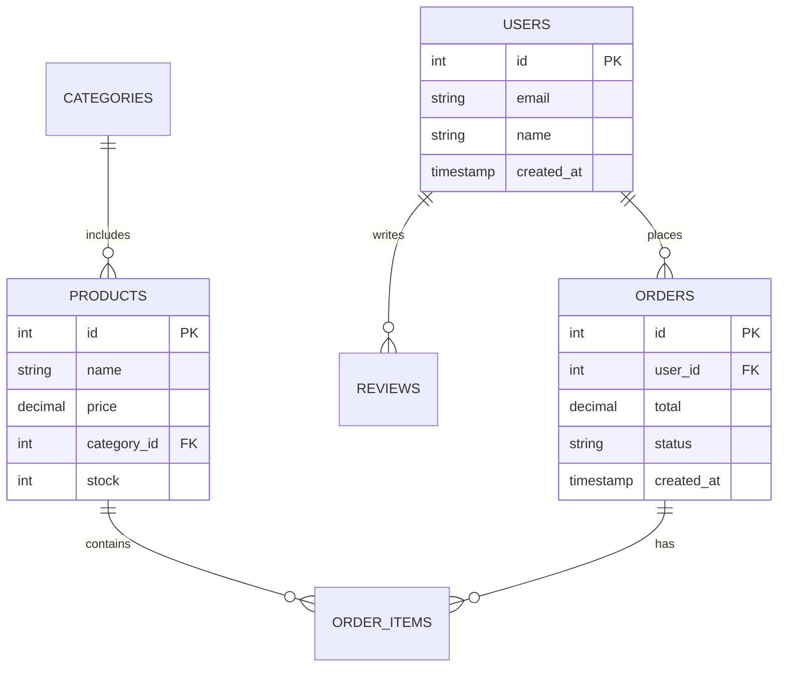
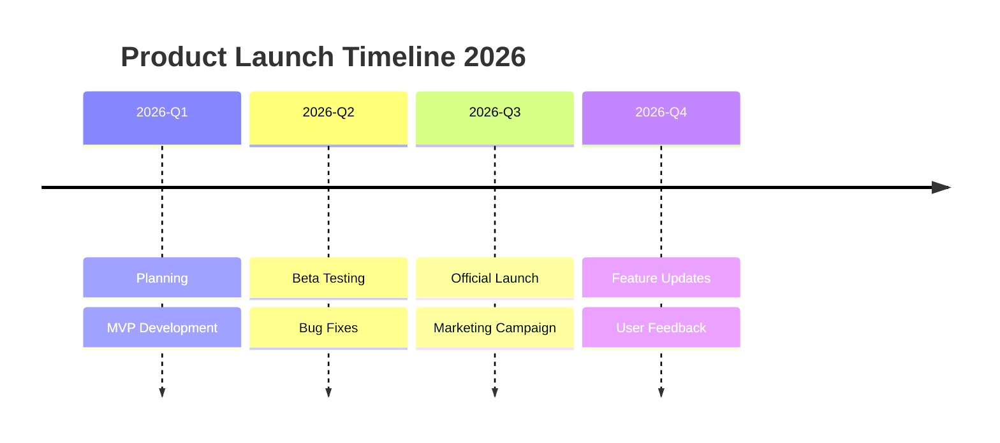
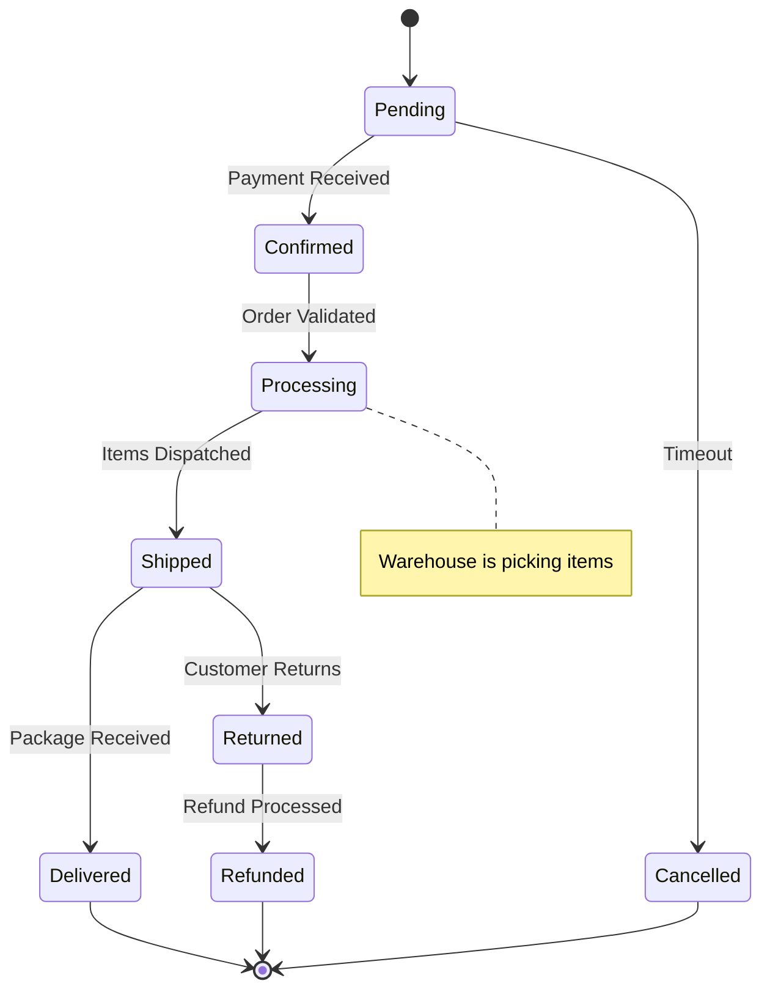
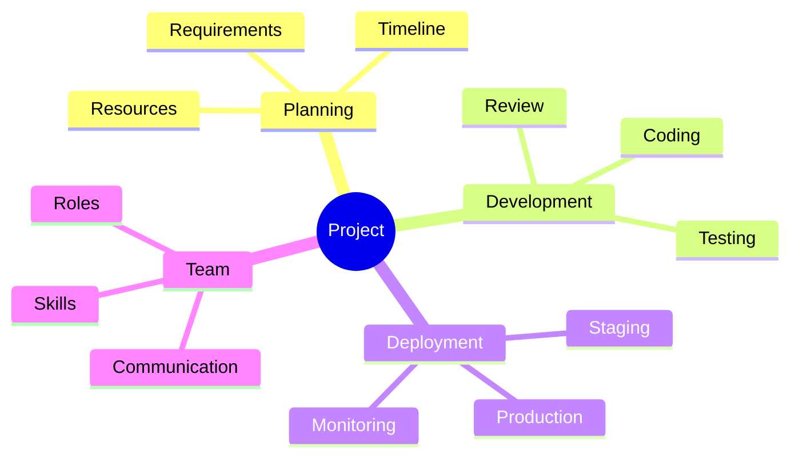
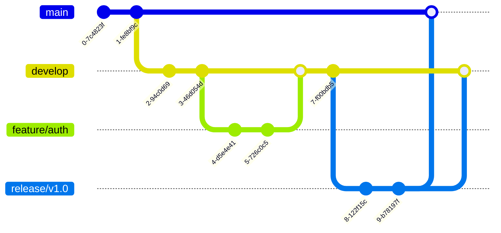
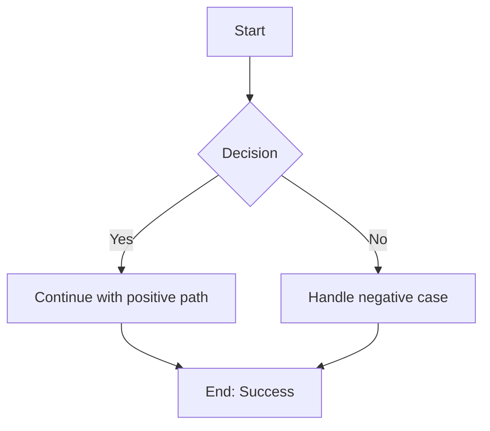
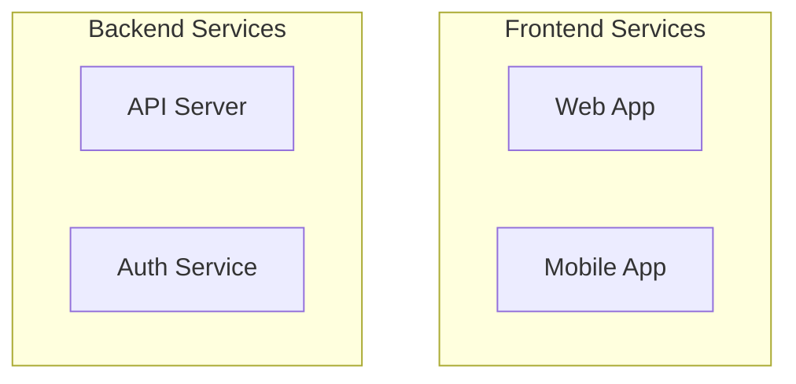
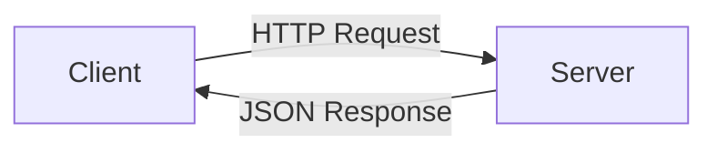

# Draw.io Diagrams - Examples

## Example 1: OAuth2 Flowchart

### User Request
"帮我画一个 OAuth2 登录流程图"

### Claude's Response

```python
# Generate Mermaid code for OAuth2 flow
mermaid_code = """
graph TD
    A[User] -->|1. Click Login| B[App]
    B -->|2. Redirect| C[Auth Server]
    C -->|3. Show Login Page| D[User Enters Credentials]
    D -->|4. Submit| C
    C -->|5. Verify| E{Valid?}
    E -->|No| C
    E -->|Yes| F[Generate Code]
    F -->|6. Redirect to App| B
    B -->|7. Exchange Code| C
    C -->|8. Return Token| B
    B -->|9. Use Token| G[API Resource]
    
    style A fill:#e1f5fe
    style C fill:#fff3e0
    style G fill:#e8f5e9
"""

# Generate Draw.io URL
url = mermaid_to_drawio(mermaid_code, title="OAuth2 Flow")
```

### Result
Opens Draw.io with a complete OAuth2 flow diagram ready for editing.

---

## Example 2: Organization Chart

### User Request
"根据这个团队成员列表生成组织架构图"

### Input Data
```
Name,Title,Manager
John,CEO,
Alice,VP Sales,John
Bob,VP Engineering,John
Charlie,Tech Lead,Alice
David,Senior Dev,Charlie
Eve,QA Lead,Bob
Frank,DevOps,Bob
```

### Claude's Response

```python
csv_data = """id,label,parent,style
John,CEO,,shape=rectangle;fillColor=#FFE6CC
Alice,VP Sales,John,shape=rectangle
Bob,VP Engineering,John,shape=rectangle
Charlie,Tech Lead,Alice,shape=rectangle
David,Senior Dev,Charlie,shape=rectangle
Eve,QA Lead,Bob,shape=rectangle
Frank,DevOps,Bob,shape=rectangle"""

url = csv_to_drawio_url(csv_data, title="Team Org Chart", diagram_type="tree")
```

### Result
Opens Draw.io with a tree-structured org chart.

---

## Example 3: Network Topology

### User Request
"画一个三层微服务架构图"

### Claude's Response

```python
mermaid_code = """
graph TB
    subgraph "Load Balancer"
        LB[NGINX]
    end
    
    subgraph "API Gateway"
        GW[API Gateway]
    end
    
    subgraph "Services"
        Auth[Auth Service]
        User[User Service]
        Order[Order Service]
    end
    
    subgraph "Data Layer"
        DB[(PostgreSQL)]
        Redis[(Redis Cache)]
        MQ[Message Queue]
    end
    
    LB --> GW
    GW --> Auth
    GW --> User
    GW --> Order
    Auth --> Redis
    User --> DB
    Order --> MQ
    Order --> Redis
    
    style LB fill:#e3f2fd
    style GW fill:#e3f2fd
    style DB fill:#f3e5f5
"""

url = mermaid_to_drawio(mermaid_code, title="Microservices Architecture")
```

---

## Example 4: Database Schema

### User Request
"创建一个电商系统的数据库ER图"

### Claude's Response



---

## Example 5: Timeline Diagram

### User Request
"展示产品发布的时间线"

### Claude's Response



---

## Example 6: State Machine

### User Request
"订单状态机"

### Claude's Response



---

## Example 7: Mind Map

### User Request
"项目管理思维导图"

### Claude's Response



---

## Example 8: Git Flow

### User Request
"解释我们的Git分支策略"

### Claude's Response



---

## Tips for Best Results

### 1. Start Simple
- Begin with basic shapes and connections
- Add styling incrementally

### 2. Use Comments


### 3. Group Related Elements


### 4. Use Meaningful Labels


### 5. Export for Different Uses
- **PNG**: For presentations, emails
- **SVG**: For web, scalable graphics
- **PDF**: For documentation, print
