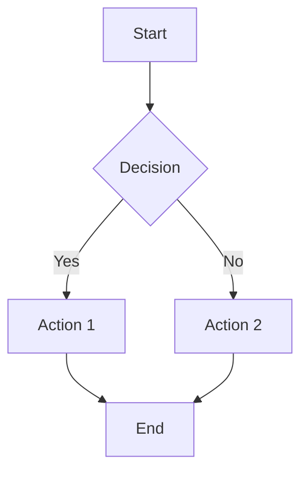
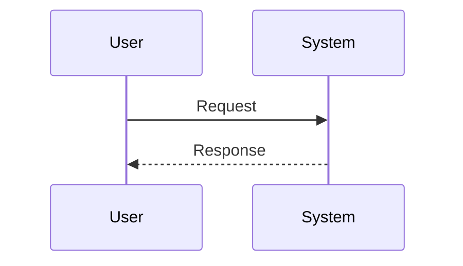
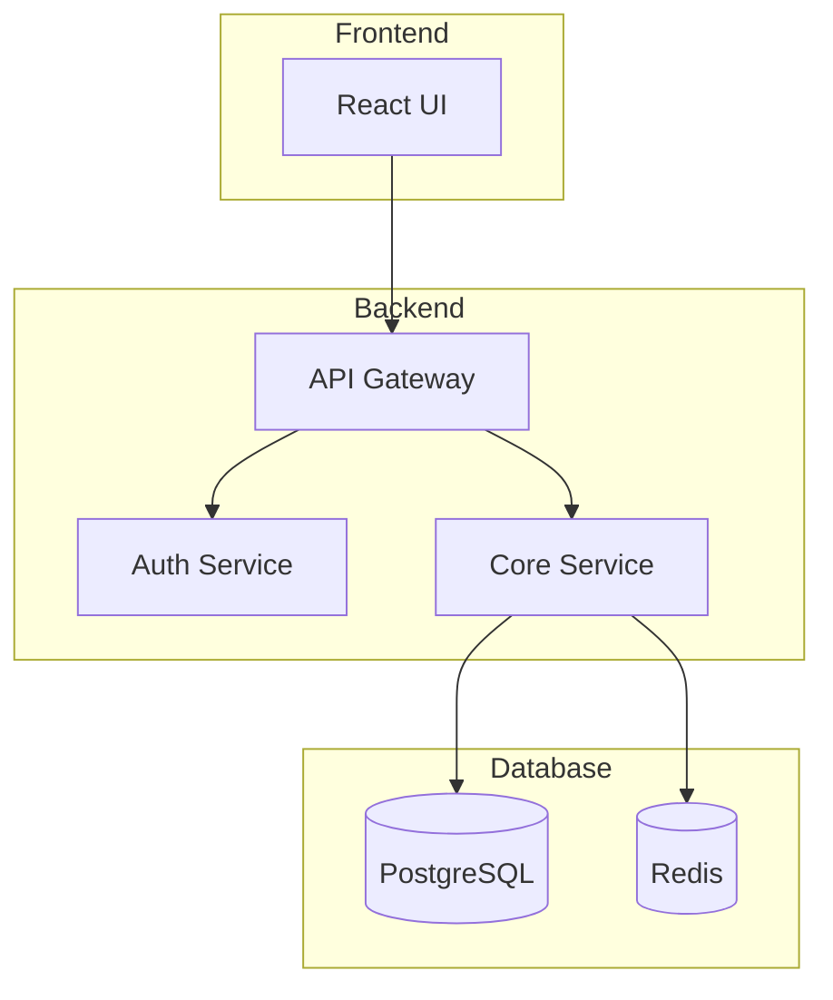

# Draw.io Diagrams - Usage Guide

## Quick Start

### Mermaid to Draw.io

```bash
# Basic usage
python scripts/mermaid2drawio.py "graph TD; A-->B; B-->C;"

# With code block
python scripts/mermaid2drawio.py """
graph TD
    A[Start] --> B{Decision}
    B -->|Yes| C[Continue]
    B -->|No| D[Stop]
"""

# With custom title
python scripts/mermaid2drawio.py "graph TD; A-->B;" --title "My Flowchart"
```

### CSV to Draw.io

```bash
# Organizational chart
python scripts/csv2drawio.py """
id,label,parent,style
CEO,CEO,,shape=rectangle;fillColor=#FFE6CC
VP1,VP Sales,CEO,shape=rectangle
VP2,VP Engineering,CEO,shape=rectangle
""" --type tree --title "Company Org Chart"

# Network topology
python scripts/csv2drawio.py """
id,label,parent,style
Server1,Web Server,,shape=ellipse
Server2,App Server,Server1,shape=ellipse
DB,Database,Server2,shape=cylinder
""" --type network --title "Network Diagram"
```

### XML to Draw.io

```bash
# Draw.io native XML format
python scripts/xml2drawio.py """
<mxGraphModel>
  <root>
    <mxCell id="0"/>
    <mxCell id="1" parent="0"/>
    <mxCell id="2" value="Start" vertex="1" parent="1">
      <mxGeometry as="geometry" width="80" height="30"/>
    </mxCell>
  </root>
</mxGraphModel>
"""
```

## Common Patterns

### Flowchart Patterns



### Sequence Diagram



### Architecture Diagram



## Integration with Claude

When using this skill with Claude:

1. **Generate the URL**: Claude will create the diagram URL
2. **Open in browser**: The URL opens Draw.io in your browser
3. **Edit as needed**: You can modify the diagram in Draw.io editor
4. **Export options**: Export as PNG, SVG, or PDF from Draw.io

### Example Claude Interaction

```
User: "画一个OAuth2流程图"

Claude: 
1. Generates Mermaid code for OAuth2 flow
2. Converts to Draw.io URL using scripts/mermaid2drawio.py
3. Opens URL in your browser
4. You see the complete OAuth2 diagram ready for editing
```

## URL Structure

The generated URLs follow this format:

```
Mermaid/XML: https://www.draw.io/#U<base64_compressed_data>
CSV:         https://www.draw.io/#CSV<base64_compressed_data>
```

**Key features:**
- Data is compressed (pako/zlib) before encoding
- URL-safe base64 encoding (no special characters)
- No data is uploaded to Draw.io servers
- Everything stays local in your browser

## Troubleshooting

### "Could not open browser"
- Manually copy the URL and paste it into your browser
- Check if webbrowser module is available

### "Diagram too complex"
- URL length may exceed browser limits
- Try splitting into multiple smaller diagrams
- Consider using PNG export directly from Draw.io

### Missing characters in diagram
- Ensure UTF-8 encoding
- Check that special characters are properly escaped

## Advanced Usage

### Batch Processing

Create multiple diagrams from a list:

```bash
# Process multiple mermaid files
for file in diagrams/*.mmd; do
    python scripts/mermaid2drawio.py "$(cat $file)" --title "$file"
done
```

### Integration with CI/CD

```bash
#!/bin/bash
# Generate architecture diagram for documentation
python scripts/mermaid2drawio.py "$(cat architecture.mmd)" \
    --title "System Architecture" \
    --save architecture_url.txt
```

## Dependencies

- **Python 3.6+**
- **Optional**: pako (for better compression)
  ```bash
  pip install pako
  ```
- **Fallback**: Uses zlib if pako not available

## File Formats

| Format | Script | Use Case |
|--------|--------|----------|
| Mermaid | mermaid2drawio.py | Quick diagrams, flowcharts |
| CSV | csv2drawio.py | Org charts, network topologies |
| XML | xml2drawio.py | Fine-grained control, existing Draw.io files |
